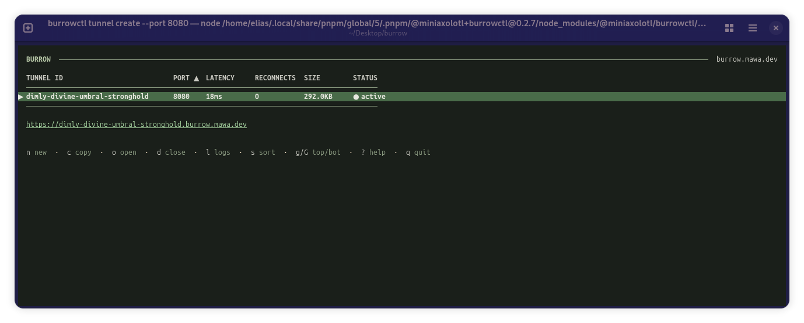
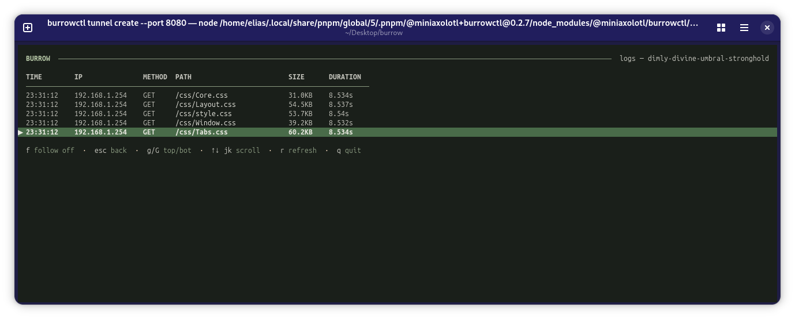
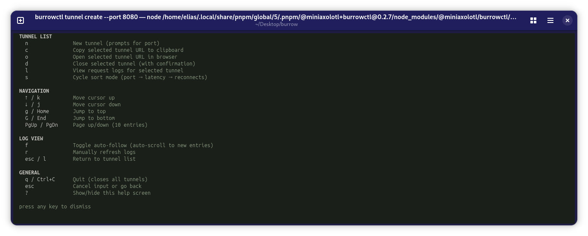

# burrow

[](https://npmjs.com/package/@miniaxolotl/burrowctl)
[](https://github.com/miniaxolotl/burrow/pkgs/container/burrowd)
[](https://hub.docker.com/r/miniaxolotl/burrowd)
[](LICENSE)

Expose local services to the internet via HTTPS subdomains.

## Client

```bash
npm i -g @miniaxolotl/burrowctl
burrowctl tunnel create --port 3000
```

Connects to `burrow.mawa.dev` by default. No account or token required.

## Self-hosting

```bash
cp .env.example .env   # set BURROW_SECRET and BURROW_DOMAIN
docker compose up -d
```

Then point your client at it:

```bash
burrowctl auth set-server your-server.example.com
burrowctl auth login <token>
burrowctl tunnel create --port 3000
```

### Tunnel Manager

  

## Docs

- [Deploy & release](documentation/deploy.md)
- [Server reference](documentation/server.md)
- [Client reference](documentation/client.md)

MIT
